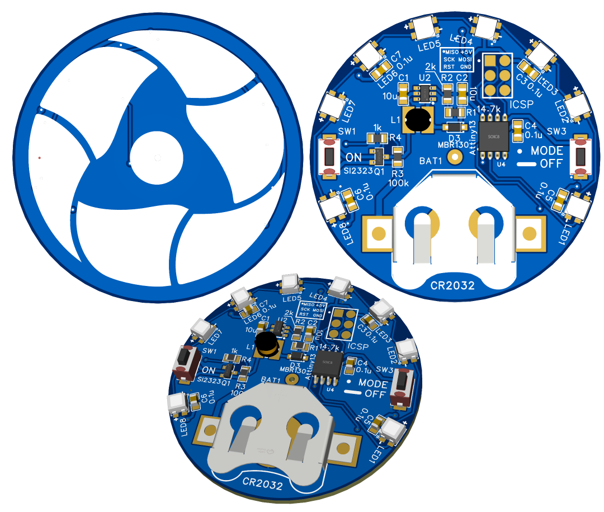
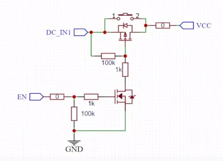
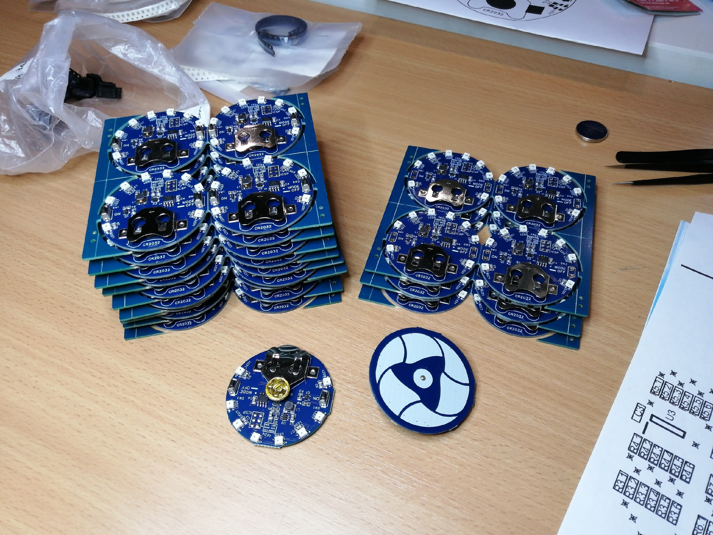

# Rosatom Badge
Сувенирный значок с мастер-класса компетенции "Электроника" чемпионата AtomSkills 2023.  
[Ссылка на проект EasyEDA](https://oshwlab.com/treegervd/rosatom_badge_edapro)

Использованные библиотеки:
* [MicroCore](https://github.com/MCUdude/MicroCore) ([MCUdude](https://github.com/MCUdude))
* [ws2812b_attiny13](https://github.com/dsprenkels/ws2812b_attiny13) ([dsprenkels](https://github.com/dsprenkels))

## Подготовка
* Установить среду [Arduino IDE](https://www.arduino.cc/en/software) и ядро [MicroCore](https://github.com/MCUdude/MicroCore)
* Выбрать в настройках проекта:  
BOD: __BOD 2.7V__  
Bootloader: __No bootloader__  
Clock: __9.6 Mhz internal osc.__  
EEPROM: __EEPROM retained__  
* Если МК новый, то первую прошивку загружать на __slow__ скорости, например __USBasp slow__ (в зависимости от программатора). Дальнейшие загрузки возможны на нормальной скорости (__USBasp__).

## Функционал
Включение значка осуществляется кнопкой __ON__. Кратковременное нажатие кнопки __MODE/OFF__ циклически переключает режимы подсветки, а удержание более 1 сек. выключает значок.  

Режимы подсветки:
* Плавный перелив
* Бегущая точка 
* Статичный белый
* Бегущая радуга

## Техническая документация
[Attiny13 datasheet](http://ww1.microchip.com/downloads/en/DeviceDoc/doc2535.pdf)  
[WS2812B datasheet](https://cdn-shop.adafruit.com/datasheets/WS2812B.pdf)

## Известные баги
* значок не выключается при уровне BOD менее 2.7V. Связано с ошибкой в схеме самоблокировки питания. В выключенном состоянии на затворе Q1 присутствует напряжение ~1.7V, чего хватает для частичного открытия ключа.  
Для исправления нужно добавить еще один N-ch MOSFET или биполярный NPN от затвора Q1 на GND.  
Исправленная схема:  
  
* В редких случаях при установке батареи все светодиоды загораются ярким красным светом. Точная причина не опеределена. Возможно, поможет резистор на 100-500 Ом в разрыв цепи U4_PB3 - LED1_DIN.  
Лечится извлечением и повторной установкой батареи.  

